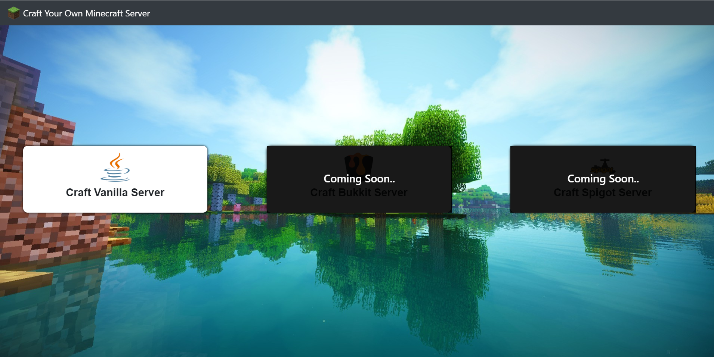
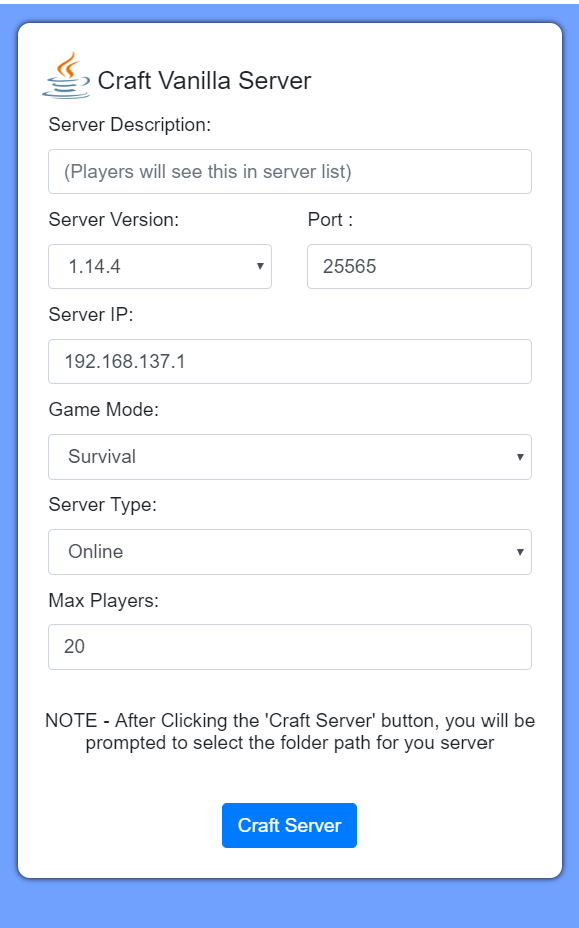
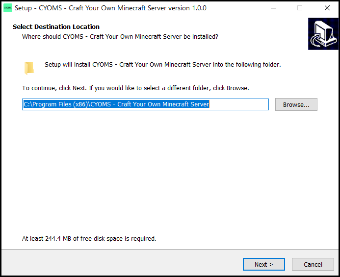

<!-- Cyoms Cover Pic -->
# CYOMS - Craft Your Own Minecraft Server

**CYOMS** (Craft Your Own Minecraft Server) is a desktop application which allows users to setup a minecraft server of any version easily.

---

## Preview 

CYOMS will soon support craft-bukkit and spigot servers, as of now it allows creation of vanilla server.

CYOMS allows configuration of basic server settings, by default it crafts the latest version of server on local IP address.

---
## Installation

1. Install using **CYOMS_setup.exe** file.
1. Installer will ask you to select the folder path where you would like to install the application.

    

    Select the folder path and hit **"next"**

