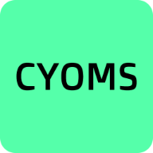

# CYOMS

<!-- Cyoms Description -->

<!-- Cyoms Cover Pic -->

**CYOMS** (Craft Your Own Minecraft Server) is a desktop application which allows users to setup a minecraft server of any version easily.