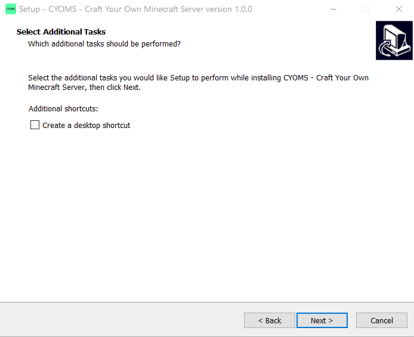
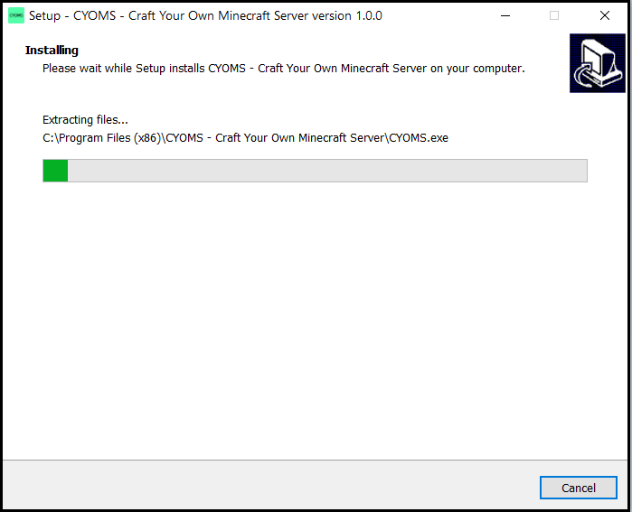
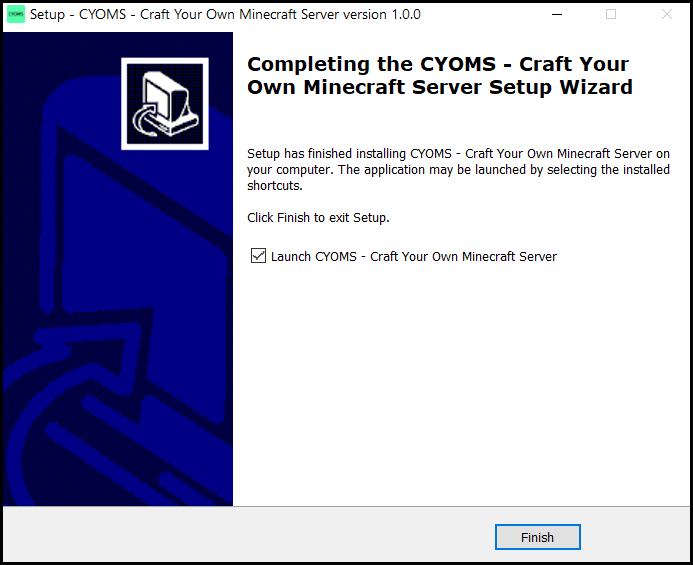

<!-- Cyoms Cover Pic -->
# CYOMS - Craft Your Own Minecraft Server

**CYOMS** (Craft Your Own Minecraft Server) is a desktop application which allows users to setup a minecraft server of any version easily.

---

## Preview 

CYOMS will soon support craft-bukkit and spigot servers, as of now it allows creation of vanilla server.

CYOMS allows configuration of basic server settings, by default it crafts the latest version of server on local IP address.

---
## Installation

 1. Install using **CYOMS_setup.exe** file
 1. The installer will guide you upon the installation steps which are as follows:
    * Select the folder where you would like to install CYOMS
    
    * Tick *'Create a desktop icon'* if you want to create a desktop icon for the application.
    Then click **Next**
    
    * Click **Install**
    * Wait till the installer finishes installing CYOMS
    

    * After installation completes, you will be asked if you want to launch CYOMS
!   
1. If you get the above screen you've **successfully** installed CYOMS