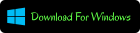
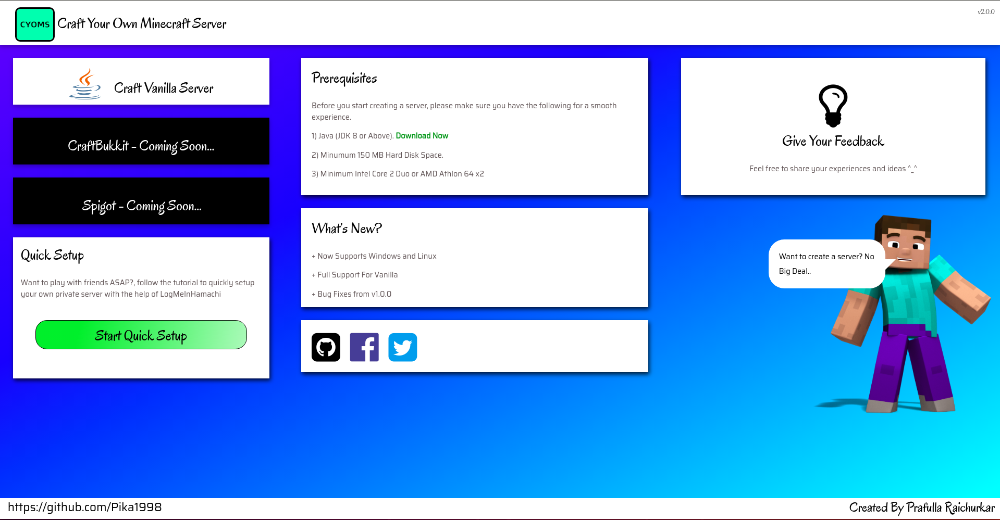
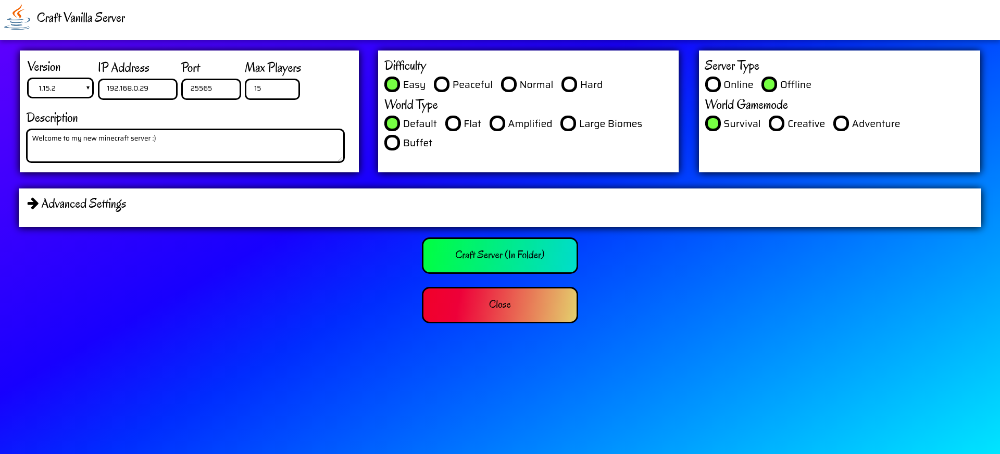
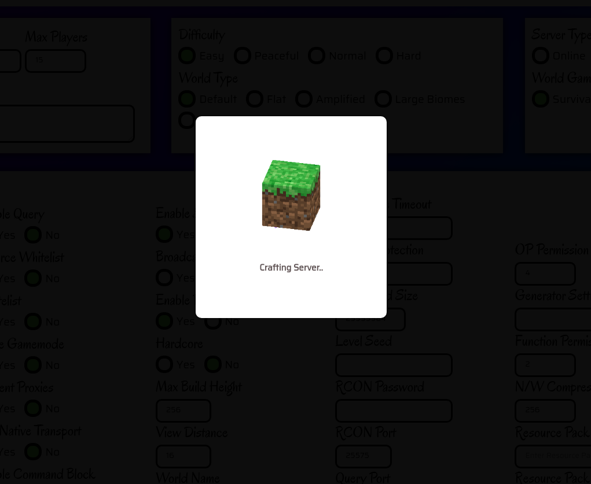
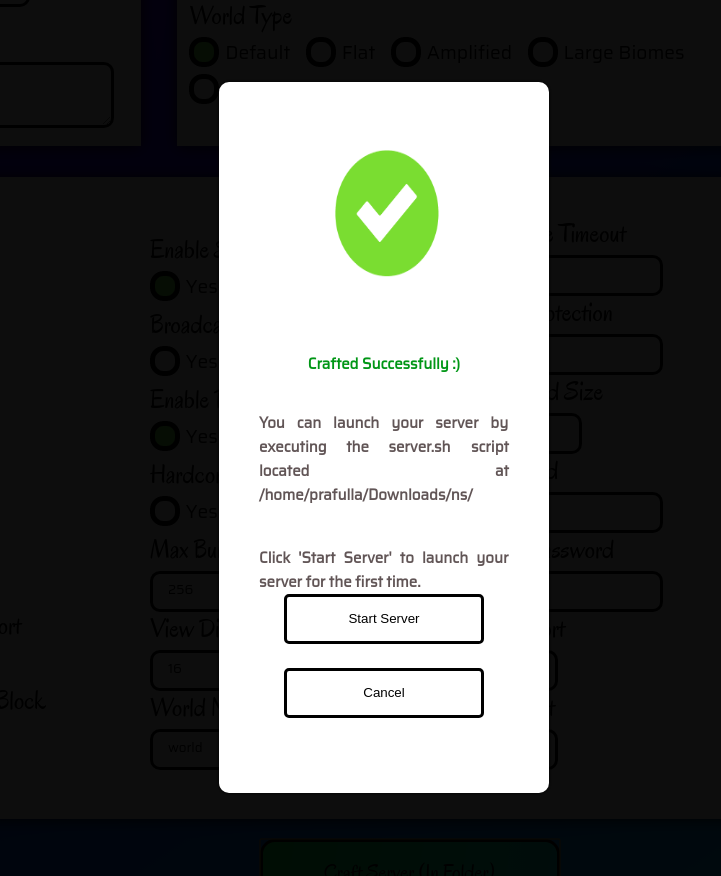

# Craft Your Own Minecraft Server | CYOMS

#### CYOMS is a desktop application to create minecraft servers quickly and easily.

Server configuration is completely GUI based. No need to download server jar files anymore!
# Download Latest Version

## For more information visit Official Website https://www.cyoms.tech
# Preview 

 
 

 
 

